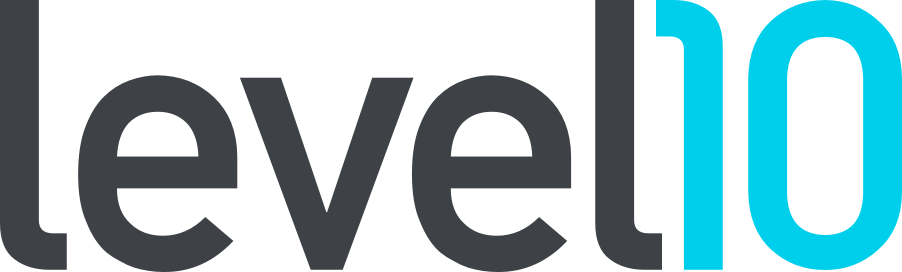

--8<-- "docs/abbreviations.md"

# Welcome to Level10 Tools Runbook
Level10 Tools, also known as *Product Team*, is a web application based on principles from EOS to assist in shaping, planning, coordinating, and developing software products. 

??? info "tech stack"
    *  Ruby 2.7.2
    *  Ruby on Rails 6 Progressive Web App
    *  Stimulus.js (For Front end interactions)
    *  Bootstrap (For Css framework)
    *  Webpack (For dependency and asset Management)
    *  Postgres
    *  AWS Elastic Container Service    

    We stick with Rails defaults for testing, what means we use:

    *  Minitest
    *  Capybara
    *  Fixtures
<!-- 
Additionally, we use:
- Webmock
- stripe-ruby-mock
- minitest-hooks
- minitest-stub-const
   -->

--8<-- "docs/getting-started.md"

## Make Commands

* `make build` - Build development container, this will take some time.
* `make run` - Start the live-reloading server, postgres database, and web application through [docker-compose.yml](docker-compose.yml)
* `make setup` - Create database(s) if they don't exist
* `make migrate` -  Migrate database(s)

## Documentation layout

    mkdocs.yml    # The configuration file.
    docs/
        index.md  # The documentation homepage.
        ...       # Other markdown pages, images and other files.

