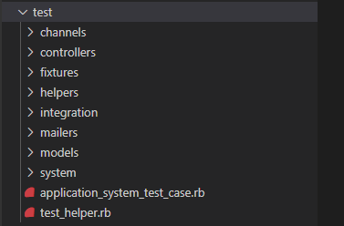
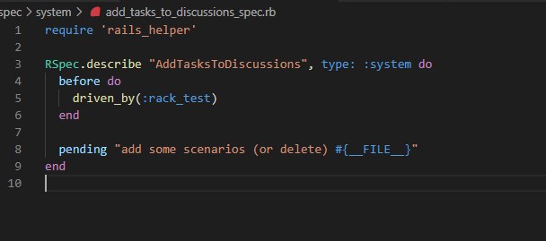

# Testing

--8<-- "docs/abbreviations.md"

The goal of testing is to verify the quality of the product as well as enable quick development, refactoring, and architectural shifts without compromising quality. 

<!-- We strive for TDD and the recipes that follow demonstrate how to achieve TDD with our current stack.  -->

<!-- 
## Behavior Driven Development
[BDD](https://semaphoreci.com/community/tutorials/behavior-driven-development) combines TDD with domain driven design and object-oriented design and analysis.   -->

<!-- ## Test Driven Development
TDD is an approach to automated software testing that involves writing a failing test before writing the production code to make it pass.   -->

<!-- We'll follow **outside-in** TDD where our first step will be to create an end-to-end test describing the feature we want users to be be able to accomplish.  In Rails, end-to-end tests are referred to as system tests. -->

<!-- ??? tip inline end "helpful resources on TDD"
    * https://learntdd.in -->

## Testing Stack
We utilize the following toolset for testing our Ruby on Rails application

1. [MiniTest](https://github.com/seattlerb/minitest):  the unit testing library that Rails' built-in testing framework is based on. 
   It provides base classes for test cases, basic assertions like ```assert_equal``` and a runner to run tests and report on their success and failre. 
2. [Capybara](https://github.com/teamcapybara/capybara):  is a Ruby library for full-stack testing of web applications.
3. [selenium-webdriver](https://www.selenium.dev/selenium/docs/api/rb/index.html) To communicate with the WebDriver protocol, an HTTP-based protocol for automating browsers

<!-- 2. RSpec
3. Database cleaner:  to ensure a clean state for database during tests
4. [FactoryBot](https://github.com/thoughtbot/factory_bot/wiki):  a fixtures replacement
5. Faker:  a library for generating fake data  -->

<!-- ### RSpec
[RSpec](https://github.com/rspec/rspec-rails) is a testing frameork that describes an application's behavior. 

We utilize RSpec by way of the [rspec-rails](https://rubygems.org/gems/rspec-rails), along with  ```capybara```, and ```selenium-webdriver```  for browser based testing. 

The tests are located in the ```spec``` directory.

??? info inline end "make command for CI"
    ```make test```        
 -->

We'll step into our dockerized environment through **bash** to create and execute tests.

```
make bash
```

!!! note 
    all commands listed below assume you are in the dockerized **bash** prompt.


## [Testing support through Rails Framework](https://guides.rubyonrails.org/v4.2/testing.html)

* The Rails framework can produce skeleton test code when creating models and controllers.
* Rails tests can also simulate browser requests allowing verification of an application's response without having to test it through the browser.
* By default, every Rails application has three environments: ```development```, ```test```, and ```production```. 
    * The database for each one of them is configured in ```config/database.yml```.
    * A dedicated test database allows you to set up and interact with test data in isolation. Tests can mangle test data with confidence, that won't touch the data in the development or production databases.

### Test Directory
The application contains a ```test``` directory with the following structure.




*  ```models``` directory contains tests for models
*  ```controllers``` directory contains tests for controllers 
* ```integration``` directory contains tests that involve any number of controllers interacting
* ```fixtures``` are a way of organizing test data (sample data).
   * YAML formatted fixtures
   * YAML fixutre format is pre-processes
   * [Fixtures API](https://api.rubyonrails.org/classes/ActiveRecord/FixtureSet.html)
* ```test_helper.rb``` contains the default configuration for tests. 

??? note inline end "Parallel Tests" 
    [Rails 6 supports parallel testing](https://edgeguides.rubyonrails.org/testing.html#parallel-testing) through the ```parallelize``` class method on TestCase. 
    The default ```number_of_processors``` is based on the number of processors on the local machine.  So its likely that running tests locally will result in parallel executions. 
    ```PARALLEL_WORKERS``` environment variable also always customization. 
    When parallelizing tests, Active Record automatically handles creating a database and loading the schema into the database for each process. The databases will be suffixed with the number corresponding to the worker. For example, if you have 2 workers the tests will create test-database-0 and test-database-1 respectively.
    Rails automatically wraps any test case in a database transaction that is rolled back after the test completes.

### Model Testing

When using Rails ```scaffolding``` to create a model, migration, controller, and views for a new resource it will also create a full test suite following Rails best practices.  

For example: 

```
rails g scaffold Task \
name:string due_at:datetime done:boolean \
assigned_to:references discussion:references
```

will create a test stubs in 
* test/models
* test/controllers
* system/test
as well as a fixture YAML in test/fixtures.

Any method defined in the ```..._test.rb``` file starting with ```test_``` (case sensitive) will run automatically when the test case is executed.

Rails supplies a ```test``` method to ease test creation.  

To execute the tests:
```
rails test test/models (controllers/system)
```

!!! note
    Running ```rails test``` will execute all tests in the **test** directory.

<!-- To execute the test run rspec follwed by the directory or file.  See [here](https://github.com/rspec/rspec-rails#running-specs) for more usage scenarios.

```
rspec spec/models
``` 
-->

??? tip
    Reset test database 

    ```
    rails db:test:prepare.
    rake db:reset RAILS_ENV=test
    ```

    Migrate test database

    ```
    rails db:migrate RAILS_ENV=test
    ```

### System Testing
System tests verify user interactions with the application, running tests in either a real or headless browser.  System tests use **Capybara** under the hood.  

These tests are located in the **test/system** directory and can be generated using 

```
rails g system_test ...
```

Using the Rails generator for controller creation will create the test stubs as well. See above.


### Handling Authentication 
System and controller testing require authentication.

[OmniAuth](https://github.com/omniauth/omniauth/wiki/Integration-Testing) which we use for handling OAuth with Google provides some facilities for mocking the authentication flow for integration tests.

Through **test mode**, all requests to OmniAuth will be short circuited to use the mock authentication hash. 

```ruby
OmniAuth.config.test_mode = true
```

A request to ```/auth/provider``` will be redirected immediately to ```/auth/provider/callback```.

```mock_auth``` configuration allows setting of authentication hashes to be used for mocking.

```ruby
OmniAuth.config.mock_auth[:google] = OmniAuth::AuthHash.new({
  :provider => 'google',
  :uid => '123545'
  # etc.
})
```


<!-- 
```
rails g rspec:system add_tasks_to_discussion
```
This will create a file ```spec/system/add_tasks_to_discussions_spec.rb```



Run the tests on the bash prompt by invoking **rspec**
```
rspec spec/system

```

!!! Note 
    Running **rspec** without specifiying a directory or file will run all tests in the **spec** directory.  -->


## Metrics
Verification is established through code coverage metrics calulcated through automated test execution. 


